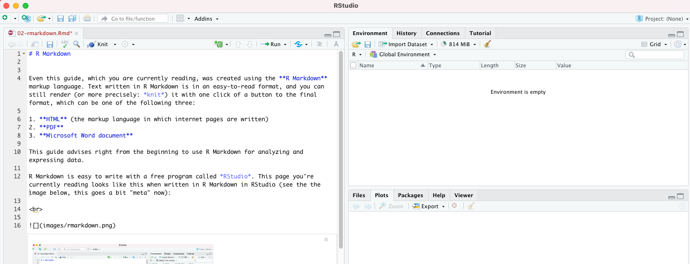

# R Markdown

Even this guide, which you are currently reading, was created using the **R Markdown** markup language. Text written in R Markdown is in an easy-to-read format, and you can still render (or more precisely: *knit*) it with one click of a button to the final format, which can be one of the following three:

1. **HTML** (the markup language in which internet pages are written)
2. **PDF**
3. **Microsoft Word document**

This guide advises right from the beginning to use R Markdown for analyzing and expressing data.

R Markdown is easy to write with a free program called *RStudio*. This page you're currently reading looks like this when written in R Markdown in RStudio (see the the image below, this goes a bit "meta" now):

 

 

<a property="dct:title" rel="cc:attributionURL" href="https://vldesign.kapsi.fi/r-guide-in-english/">R guide</a> by <a rel="cc:attributionURL dct:creator" property="cc:attributionName" href="http://www.linkedin.com/in/ville-langen">Ville Langén</a> is licensed under <a href="http://creativecommons.org/licenses/by-sa/4.0/?ref=chooser-v1" target="_blank" rel="license noopener noreferrer" style="display:inline-block;">Attribution-ShareAlike 4.0 International</a>

