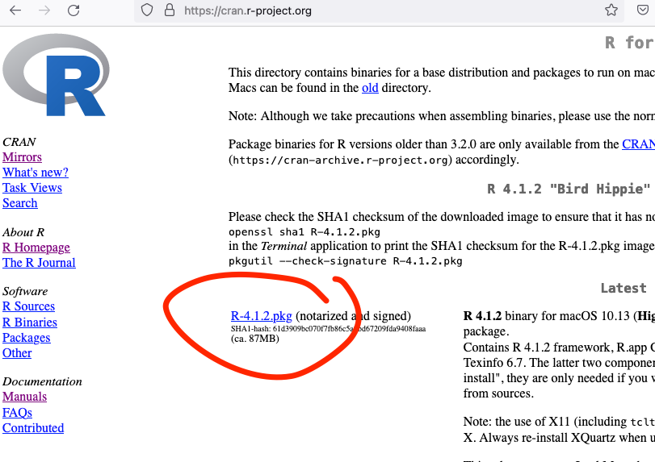

# Installation on a computer

You will need to install the following two installation packages on your Mac (if they are not already installed):

1. R **(install this first)**, and
2. RStudio.

Both are super easy to install, more on that below.

## R language installation

First, go to [https://cran.r-project.org/](https://cran.r-project.org/).

Click on "Download R for macOS".

 

 

On the next page, click on the topmost download link. Install the downloaded package on your Mac.

 

## Installation of RStudio

Next, install RStudio on your machine:

Go to [https://www.rstudio.com/products/rstudio/download/](https://www.rstudio.com/products/rstudio/download/).

Click on the download link for the free "RStudio Desktop" (see image below) and install the program on your Mac.
  

  

When you click on the link, the site will move you forward on the page (see image below) and remind you that R must first be installed, but you already did that. Press the link "DOWNLOAD RSTUDIO FOR MAC", and a file called RStudio... .dmg will be downloaded to your computer, install RStudio from that file on your computer.

 

 

<a property="dct:title" rel="cc:attributionURL" href="https://vldesign.kapsi.fi/r-guide-in-english/">R guide</a> by <a rel="cc:attributionURL dct:creator" property="cc:attributionName" href="http://www.linkedin.com/in/ville-langen">Ville Langén</a> is licensed under <a href="http://creativecommons.org/licenses/by-sa/4.0/?ref=chooser-v1" target="_blank" rel="license noopener noreferrer" style="display:inline-block;">Attribution-ShareAlike 4.0 International</a>
