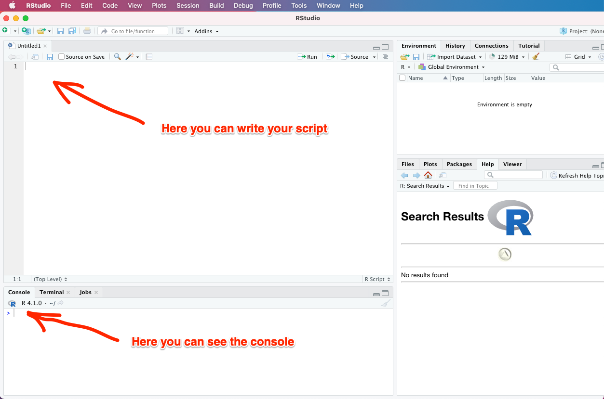
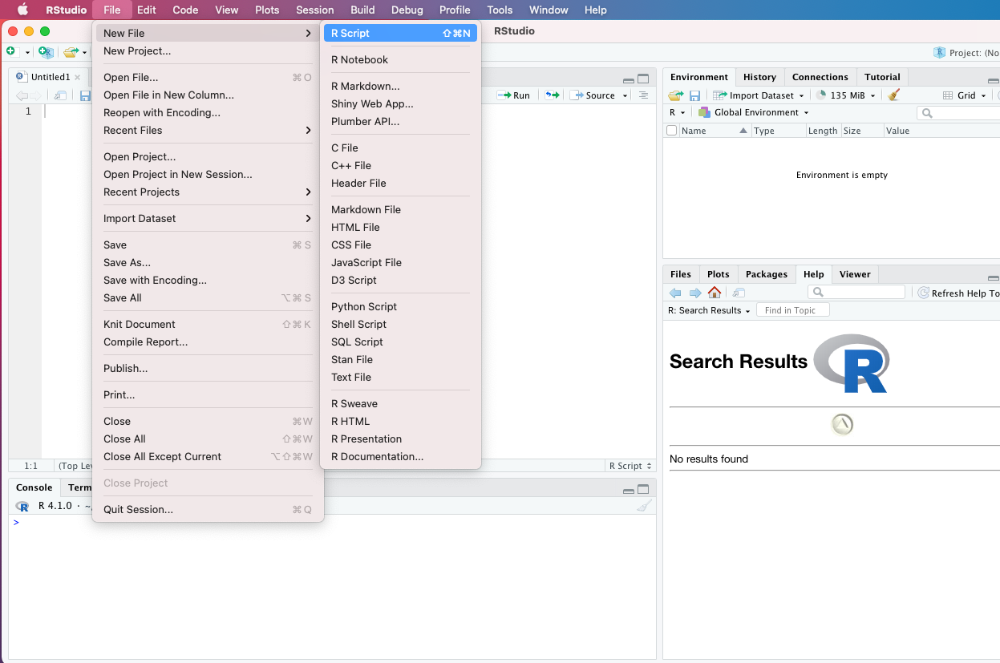
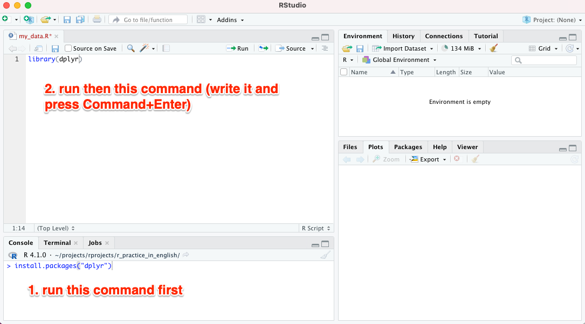

# R scripts

*R-scripts* (text files containing code in R programming language) are similar to the ones in e.g. Base SAS. They simply contain:

1. Code in the R programming language
2. Code documentation

    -- **Note! Remember to document a lot** so that you can understand your own code even after a long time!

<br>

Documentation is done in R by adding ```#``` in front of your own comments. Below is an example of an R script (you don't need to run this yourself):

```
# The text after the hashtag is not code but rather your own commenting.
# The next line, on the other hand, shows code of the R programming language:
print("Hello World")
```

<br>

Both R scripts and R Markdown documents are convenient to make with the RStudio program, which we will discuss next.

<br>

## Basic view of RStudio

RStudio has a variety of views and buttons, but you only need two to begin coding (see image below):

1. The window in which you write your R script (the so-called source window)
2. Console window


<br>


<br>

## Creating an R script

Create a new **R script (file extension .R)** by selecting *File --> New File --> R Script* from the RStudio menu (see image below):

<br>



<br>
<br>

Save the empty R script you created by selecting *File --> Save as...* and giving the file a name:

*my_data.R*

<br>

## Downloading of dplyr

Data processing in R is greatly facilitated by the auxiliary package *dplyr*. Install it right away on your computer as follows (see the image below): in the lower left corner of RStudio, click on the tab *Console*. After the character *>* that appears there, write the following command:

``` install.packages("dplyr") ```

After that, click somewhere on the window of your document *my_data.R*. At the beginning of it, write the following code to download the *dplyr* package for use in this project:

``` library(dplyr) ```

**Once you've typed the line above, go somewhere on that line and press the key combination ***Cmd+Enter*** on a Mac* (Cmd is the button that looks like a four-leaf clover). By doing this, you have just run that line and the functionalities of the *dplyr* package are available to you.




<br>
<p xmlns:cc="http://creativecommons.org/ns#" xmlns:dct="http://purl.org/dc/terms/"><a property="dct:title" rel="cc:attributionURL" href="https://vldesign.kapsi.fi/r-guide-in-english/">R guide</a> by <a rel="cc:attributionURL dct:creator" property="cc:attributionName" href="http://www.linkedin.com/in/ville-langen">Ville Langén</a> is licensed under <a href="http://creativecommons.org/licenses/by-sa/4.0/?ref=chooser-v1" target="_blank" rel="license noopener noreferrer" style="display:inline-block;">Attribution-ShareAlike 4.0 International</a></p>