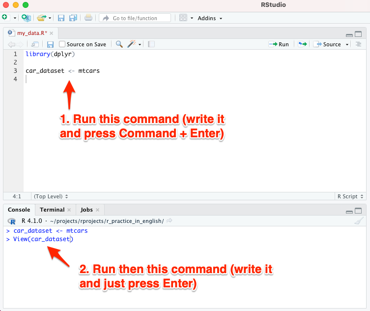
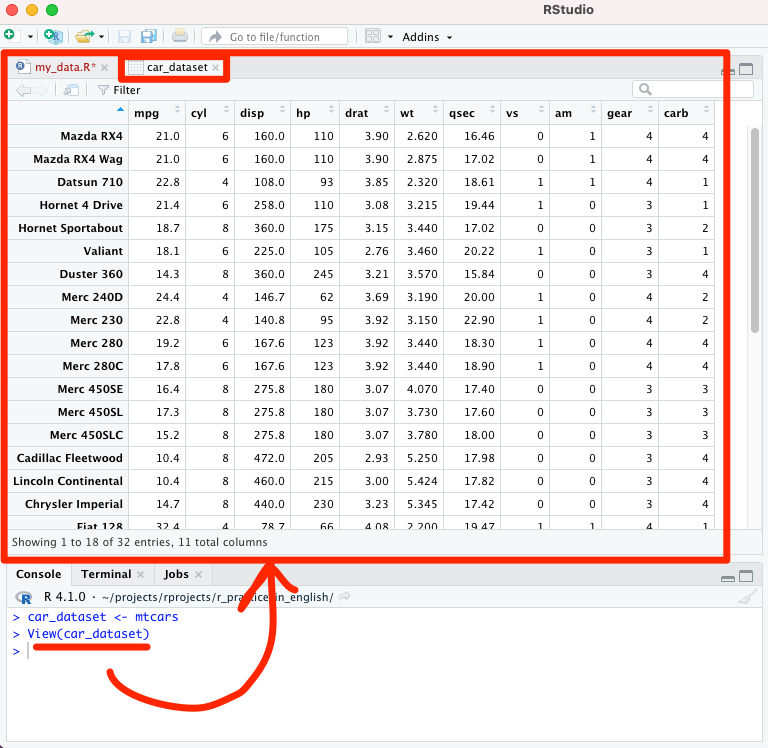
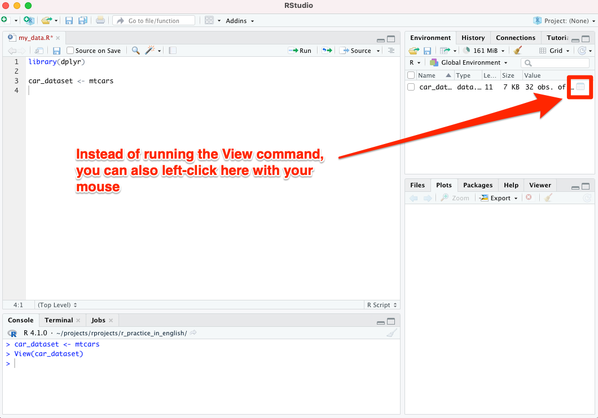
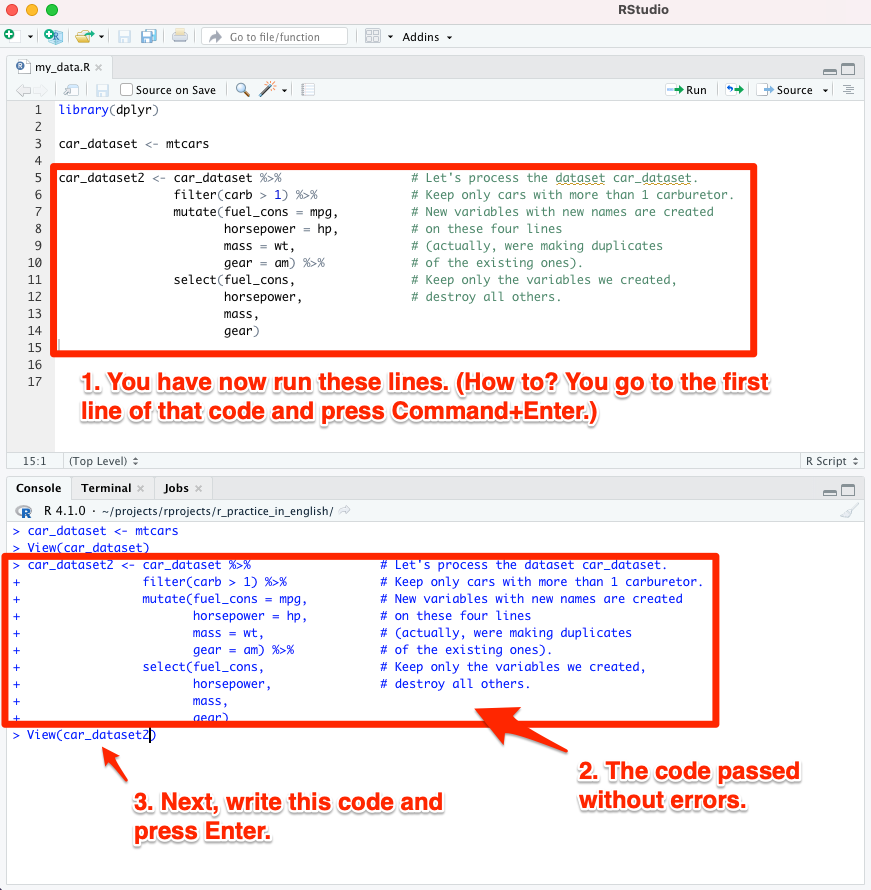
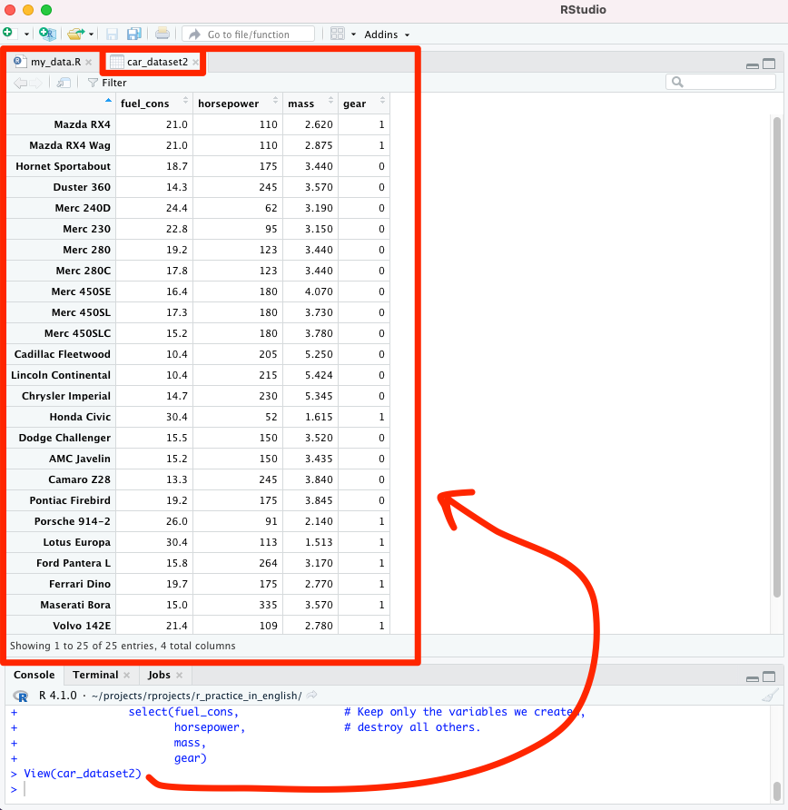
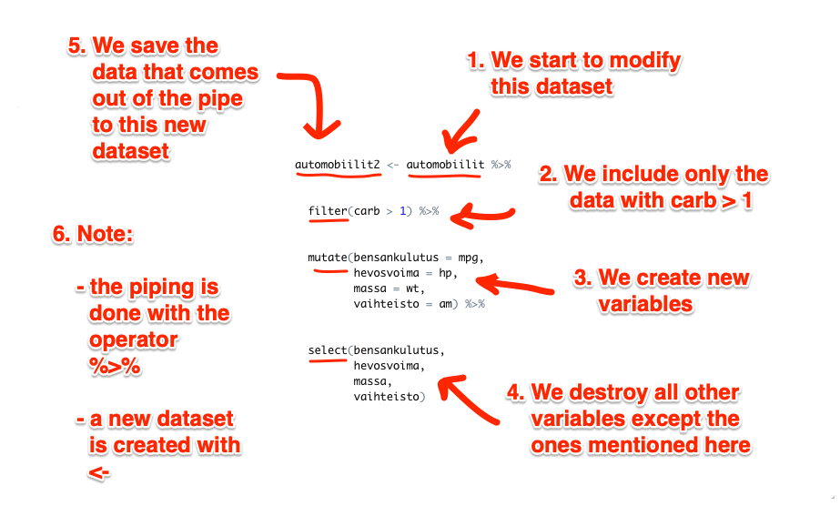

# Example dataset

When learning R, you can make use of freely available example datasets. Let's select a data set called *Motor Trend Car Road Tests* (abbreviation: *mtcars*), and start looking at and working with the variables in it.

First, let's create our own new dataset *car_dataset*, into which *mtcars* will be copied as is (see image below):

```car_dataset <- mtcars''`

SAS users are used to seeing the new dataset in a special SAS window in such a dataset creation situation. In RStudio you can get a similar view, so-called *data view*, by running the following command in the *Console* tab at the bottom left:

``` View(car_dataset) ```


<br>



<br><br>

After you have typed the View(car_dataset) command, the following view will open (image below):



<br>

Take a look at the data view generated by the *View* command. You will notice the following points from a biostatistician's point of view:

1. The "participants" in this case are car brands, and
2. "biomarkers" (variables) are e.g. horsepower, cylinders, etc.

**Note! Instead of the View() command, you can left-click on the "Value" column of the dataset, this does the same as the View() command (see the image below):**

 

<br>




## Editing data with dplyr

Let's simplify our dataset. We only keep the following four variables:

1. *mpg* (describes fuel consumption)
2. *hp* (describes horsepower)
3. *wt* (describes mass)
4. *am* (describes transmission type - automatic vs. manual transmission)

We will also give a new name to each of these variables.

In addition to this, for practice:

- We exclude from our dataset all such cars that do not have at least 2 carburetors in use.
   - If you don't know what a carburetor is, it doesn't matter (who would know, after all). This could equally well be "the participant has to have more than one kidney" in some other dataset.

With the commands of the *dplyr* package, it is very easy to implement the things mentioned above. Write the following lines in your R script *my_data.R*. You can copy-paste them directly from below if you are reading the electronic version of this quick guide.

See also the image below:


```
car_dataset2 <- car_dataset %>%                  # Let's process the dataset car_dataset.
                filter(carb > 1) %>%             # Keep only cars with more than 1 carburetor.
                mutate(fuel_cons = mpg,          # New variables with new names are created
                       horsepower = hp,          # on these four lines
                              mass = wt,         # (actually, were making duplicates
                              gear = am) %>%     # of the existing ones).
                       select(fuel_cons,         # Keep only the variables we created,
                              horsepower,        # destroy all others.
                              mass,
                              gear)
```

Run the lines you entered: you can either paint the entire row with the mouse and run it with the key combination Command+Enter, or just go to the first line of that row and press Command+Enter.

<br>




<br>


View the dataset you created by running the *View* command in the console, this time from the new dataset *car_dataset2*:

``` View(car_dataset2) ```

You will notice that the code you ran has worked as expected (see image below).


<br>



## Recap of dplyr

When using *dplyr*, the different commands (above: ```filter```, ```mutate``` and ```select```) are fed through the "pipe" to be executed as a sequence of actions, and the following **operator** has to be in-between the commands: ``` %>% ```.

Let's recap how the pipe with *dplyr* worked (see also the image below):

1. ```filter```: we exclude something from our data (in this example we excluded cars with less than 2 carburetors).
2. ```mutate```: creation of new variables
3. ```select```: keep the variables that are mentioned, all others are destroyed
4. ``` %>% ```-operator: with this the commands are piped as a sequence of actions
5. ``` <- ``` operator: this saves the data coming out of the pipe into a new dataset

Just knowing these few commands makes it possible to assemble a complex dataset for your research. No need to memorize commands; you can start by copying these for yourself from e.g. this instruction, and you can find a lot of additional examples online.


<br>



<br>
<p xmlns:cc="http://creativecommons.org/ns#" xmlns:dct="http://purl.org/dc/terms/"><a property="dct:title" rel="cc:attributionURL" href="https://vldesign.kapsi.fi/r-guide-in-english/">R guide</a> by <a rel="cc:attributionURL dct:creator" property="cc:attributionName" href="http://www.linkedin.com/in/ville-langen">Ville Langén</a> is licensed under <a href="http://creativecommons.org/licenses/by-sa/4.0/?ref=chooser-v1" target="_blank" rel="license noopener noreferrer" style="display:inline-block;">Attribution-ShareAlike 4.0 International</a></p>