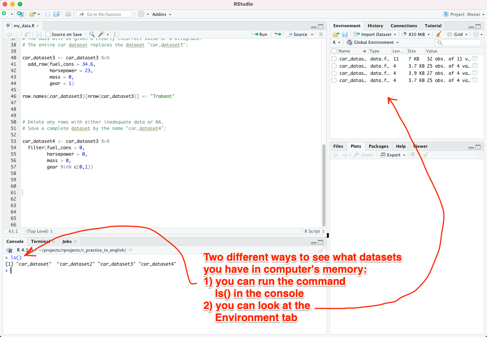

# Destruction of datasets

When you type ``` ls() ``` in the console, you can see all the datasets stored in R's memory - or, in the case of R, it's better to talk about objects.

The list looks roughly like this:

```
[1] "car_dataset" "car_dataset2" "car_dataset3" "car_dataset4"
```

<br>

Alternatively, you can view the list of objects in a specific tab of RStudio, see the image below:




<br>
For the sake of practice, let's destroy everything except the dataset "car_dataset" with the following command, which you can type directly into the console:

``` rm(car_dataset2, car_dataset3, car_dataset4) ```

When you re-run ``` ls() ``` in the console, you will only see the dataset "car_dataset":

``` 
[1] "car_dataset"
``` 

<br>

*Good to know: the command ``` rm(list = ls()) ``` destroys all objects from the R session memory (it clears the entire workspace).*

*Good to know II: some experienced R users never destroy anything, but occasionally reset R and start from a clean slate. This is done by choosing "Session" -> "Restart R" from the top menu of RStudio*
 
<br>
<p xmlns:cc="http://creativecommons.org/ns#" xmlns:dct="http://purl.org/dc/terms/"><a property="dct:title" rel="cc:attributionURL" href="https://vldesign.kapsi.fi/r-guide-in-english/">R guide</a> by <a rel="cc:attributionURL dct:creator" property="cc:attributionName" href="http://www.linkedin.com/in/ville-langen">Ville Langén</a> is licensed under <a href="http://creativecommons.org/licenses/by-sa/4.0/?ref=chooser-v1" target="_blank" rel="license noopener noreferrer" style="display:inline-block;">Attribution-ShareAlike 4.0 International</a></p>