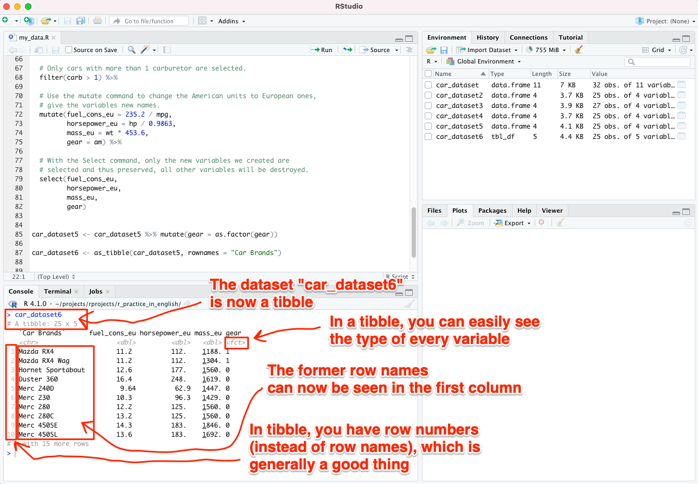

# Categorical variables

A variable describing e.g. fuel consumption (or the height of a research patient) on a continuous scale is a **continuous variable**. Contrary to this, the hypothetical variable *hypertension*, which was introduced in chapter 9 and received either the value ```0``` or ```1```, is a **categorical variable**. More specifically, such dichotomous or binary variables, receiving most often either ```0``` or ```1``` as their values, are called ***dummy variables***.

It is generally wise to tell R which of your variables are categorical variables so that R doesn't mistakenly treat them as continuous variables in any analyses. In R, categorical variables should be saved as *factor* type. This is very easy.

You can view your data by typing the following command in the *Console*:

```
car_dataset5
```

<br>

Even a quick glance at the output (only 4 lines are shown below) will reveal you that *gear* is meant to be a categorical variable in these data. The other variables are clearly continuous variables.


```{r kategorinen_muuttuja, echo=FALSE}

head(car_dataset5, n=4)

```

<br>

## as.factor command

Let's change the variable *gear* to *factor*, i.e. turn it into a categorical variable. We will save it over itself - we will not create a new dataset. There are a few easy ways to do this.

1. option: With Base-R, the following would be done:

```
car_dataset5$gear <- as.factor(car_dataset5$gear)
```

Note that in the expression ```car_dataset5$gear``` we indicate with the dollar sign ```$``` that we want to change only the variable *gear* from the dataset *car_dataset5* into *factor*.

2. option is to do the same thing using *dplyr*:

```
car_dataset5 <- car_dataset5 %>% mutate(gear = as.factor(gear))
```

Run either of the methods mentioned above. If you now look at your data again by typing the following command in the *Console*, you will not really see any difference from before (only 4 lines shown here):

```
car_dataset5
```


```{r kategorinen_muuttuja2, echo=FALSE}

head(car_dataset5, n=4)

```


<br>

Indeed, it is problematic that you can't see in that output if R knows whether the variables are continuous or categorical.

*tibble* comes to the rescue. *tibble* is an improved version of the Base-R's "dataframe" (in the previous examples, "car_dataset", "car_dataset2" etc. were in Base-R format). At this point, tou don't need to understand anything about data frames or why *tibble* is a better format - just take my word for it.


## tibble

Let's change our dataset "car_dataset5" into a *tibble*. Let's save the new data set as "car_dataset6".

At the same time, we are making another important correction. So far, the rows in our dataset have been named after car brands, but naming rows in general is not recommended today. **When we switch to the *tibble* format, line names are destroyed and replaced by line numbers**. Car brands (or analogously: "code identifiers of participants") will appear in the first column, which is a better practice.

It works like this - and notice that the command is nowadays ```as_tibble``` and not ```as.tibble```:

```
car_dataset6 <- as_tibble(car_dataset5, rownames = "Car Brands")

```

<br>

After that, when you type the following command into the console, you can easily see that R indeed knows that the variable *gear* is categorical (or, in R's terms, a *factor*):


```
car_dataset6
```

<br>
Below you can see 4 lines of data (see also the image below):


```{r kategorinen_muuttuja3, echo=FALSE}

head(car_dataset6, n=4)

```

<br>



<br>
<p xmlns:cc="http://creativecommons.org/ns#" xmlns:dct="http://purl.org/dc/terms/"><a property="dct:title" rel="cc:attributionURL" href="https://vldesign.kapsi.fi/r-guide-in-english/">R guide</a> by <a rel="cc:attributionURL dct:creator" property="cc:attributionName" href="http://www.linkedin.com/in/ville-langen">Ville Langén</a> is licensed under <a href="http://creativecommons.org/licenses/by-sa/4.0/?ref=chooser-v1" target="_blank" rel="license noopener noreferrer" style="display:inline-block;">Attribution-ShareAlike 4.0 International</a></p>