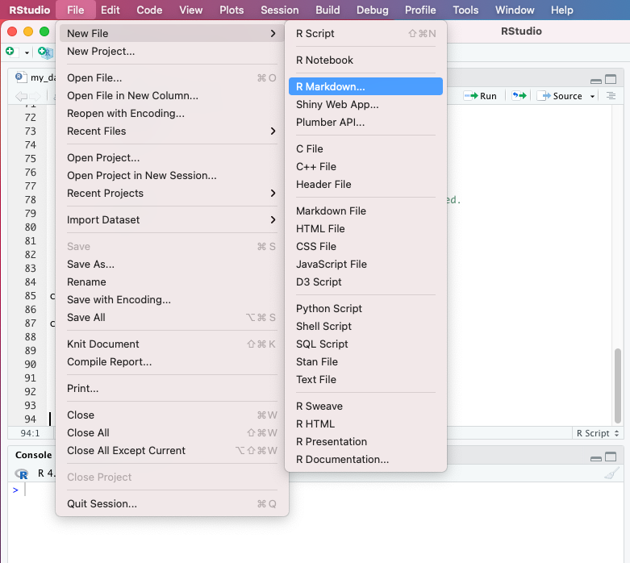
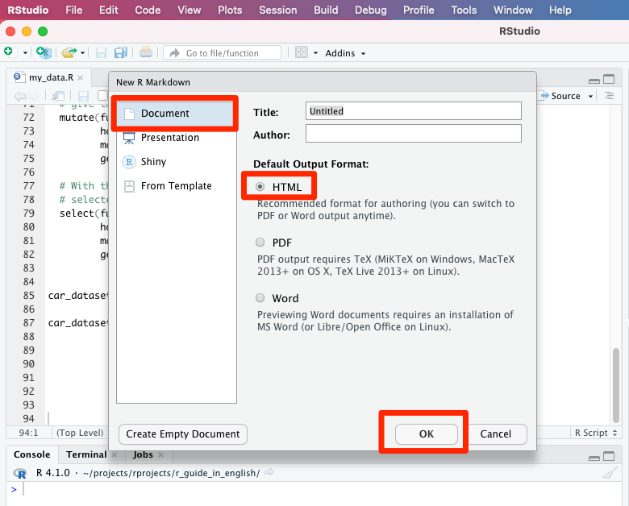
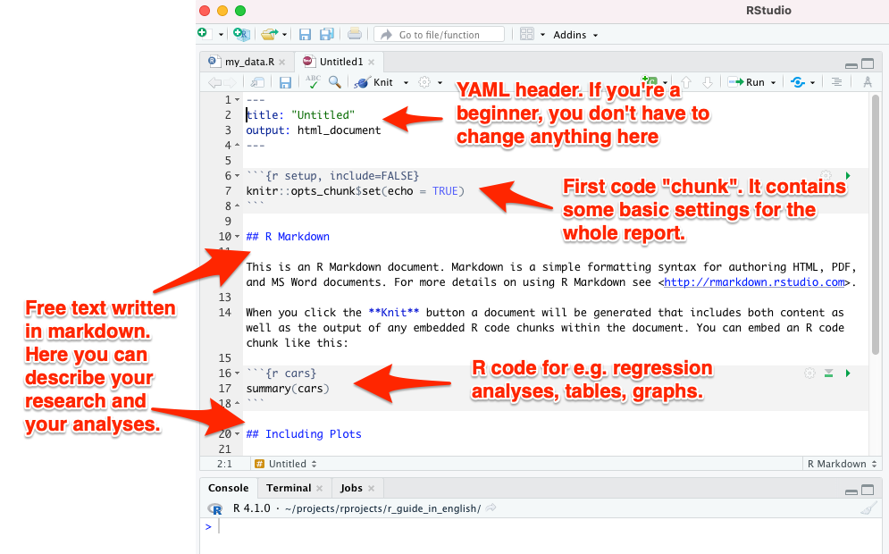
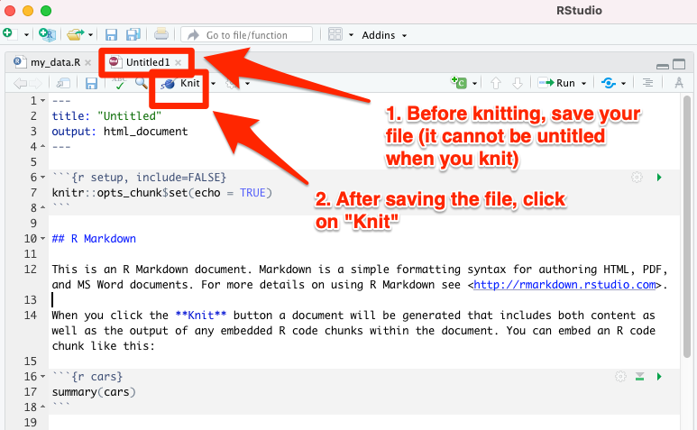

# Creating R Markdown

Create an **R Markdown file (file extension .Rmd)** by selecting *File --> New File --> R Markdown* from the RStudio menu (see image below).



<br>

Next you will see a menu from which you can choose whether you are working on a web page (i.e. an HTML file), a PDF or a Word file. The program will suggest you an HTML-type publication - accept this suggestion by selecting *OK*.





<br>

This will create a new .Rmd file with the following sections (see also the image below):

1. A YAML header at the very beginning of your document: it contains settings such as the final format of the report (HTML vs. PDF vs. Word file)
2. Your free text written with markdown (e.g. the text you are reading right was written in such Markdown)
3. Special code "chunks", which can contain code from R and a few other programming languages



<br>

## Knit to final product

RStudio created a template R Markdown file for you with some content already. You can instantly convert (or "knit") the document into its final format. Do the following:

1. First save your file by selecting *File --> Save as...* and give the file any name you wish
2. Then press the button "Knit" above your code (see image below)


<br>
<br>

At this point, RStudio's own web browser will open, and you will see the final result of the R Markdown document that you just converted to an HTML format. If everything went ok, you will see the view below:


<br>

## YAML header

The YAML header is isolated from the rest of the document between two lines of the following dashes ```---```. If you are a beginner, you don't need to modify the YAML section at all. You can start using R Markdown directly with the YAML header that RStudio created for you when you selected *File --> New File --> R Markdown* from the RStudio menu.

However, if you are excited to try adjusting YAML as well, you can familiarize yourself e.g. with the online instructions in the book [R Markdown: The Definitive Guide.](https://bookdown.org/yihui/rmarkdown/html-document.html)

You can easily add your name and date to your document with the instructions on that page.


## Writing with R Markdown

The R Markdown code itself is mostly plain text - just like writing with Word, Notepad, etc. **Bold text** can be made by putting two asterisks around the text: ```**Bold text**```. You can create *Italicized text* by putting only one asterisk on either side of the text: ```*Italicized text*''.

## "Chunks"

In chunks, you can run statistical analyses and create tables and graphs with R code. Each chunk must have its own unique title, which you can invent freely; if you use the same title in two different chunks, R will hang the process and warn you of an error when you try to convert the document with the "Knit" button.

Chunks are separated from free text - that is, from the markdown section - by writing three grave accents both before and after the code. [The grave accent](https://en.wikipedia.org/wiki/Grave_accent) is particularly familiar to those who have studied French. If you don't know how to type a grave accent with the keyboard, you can always copy-paste them from elsewhere, e.g. from this quick guide you're reading.

Below is an example of a working chunk:

````markdown
`r ''````{r fuel_consumption, echo=FALSE}
plot(car_dataset6$horsepower_eu, car_dataset6$fuel_cons_eu)
```
````

When ```echo=FALSE``` shown above is included, the output of the command ```plot(car_dataset6$horsepower_eu, car_dataset6$fuel_cons_eu)``` is seen, but not the code itself ```plot(car_dataset6$horsepower_eu, car_dataset6$fuel_cons_eu)``` when our R Markdown document is converted into the final output.

For more detailed information on how to use the ```echo``` option to control what is shown in the final output, you can read [this text.](https://rmarkdown.rstudio.com/lesson-3.html)


## First chunk

The first chunk is special: it should be named "r setup". In this first chunk, you adjust the settings that apply to all subsequent chunks. In addition, here you can download the source file (or sometimes several source files), where in this case the dataset "car_dataset6" that you've created can be found.

Make the following edits to the first chunk:

1. Call the *dplyr* package with the library command
2. Add *my_data.R* to the first chunk

The first chunk should look like this:


````markdown
`r ''````{r setup, include=FALSE}
knitr::opts_chunk$set(echo = TRUE)
library(dplyr)
source("my_data.R")
```
````

<br>
<p xmlns:cc="http://creativecommons.org/ns#" xmlns:dct="http://purl.org/dc/terms/"><a property="dct:title" rel="cc:attributionURL" href="https://vldesign.kapsi.fi/r-guide-in-english/">R guide</a> by <a rel="cc:attributionURL dct:creator" property="cc:attributionName" href="http://www.linkedin.com/in/ville-langen">Ville Langén</a> is licensed under <a href="http://creativecommons.org/licenses/by-sa/4.0/?ref=chooser-v1" target="_blank" rel="license noopener noreferrer" style="display:inline-block;">Attribution-ShareAlike 4.0 International</a></p>