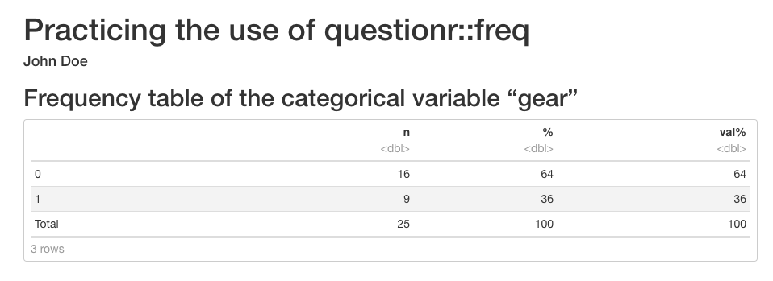

# Analyses with R Markdown

You can now start analyzing your data in your "car_dataset6" in R Markdown document. If you want, you can destroy text and chunks from RStudio's template or write over them. However, be careful not to mess up the YAML header or the first "r setup" chunk.

## Viewing the dataset

### head command

We make use of the very useful command *head* which prints the first 6 rows of our data. We get a quick glance at our data and, if we want, we can share it forward in the form of R Markdown.

You can e.g. write "Here is an excerpt of a few rows of our finalized article data". After that, you can hit an empty line with enter and write the next chunk, which must have 3 heavy accents at the beginning and at the end:


````markdown
`r ''````{r head_of_our_data, echo=FALSE}

head(car_dataset6)
```
````

<br>
Here is an excerpt of a few rows from our finished data in this article.

```{r head_datastamme, echo=FALSE}

head(car_dataset6)

```

<br>

While *tibble* is neat in many ways, I personally don't like the way the decimal places in *tibble*-type datasets are printed. To remedy this and to beautify the output, the command *kable* comes to our help.


### kable beautifies

To make the output nicer to look at, add the command *kable*, which comes with the package *knitr*. You can install that package by issuing the following command in the console:


```
install.packages("knitr")
```

<br>

In addition to this, you should invoke *knitr* by adding it to the first chunk named *r setup*. After that, your first chunk will look like this:


````markdown
`r ''````{r setup, include=FALSE}
knitr::opts_chunk$set(echo = TRUE)
library(dplyr)
library(knitr)
source("my_data.R")
```
````

<br>

After this you can use the *kable* command.

Let's pipe all the commands as follows:


````markdown
`r ''````{r head_of_our_data_plus_kable, echo=FALSE}

car_dataset6 %>% head %>% kable
```
````

<br>

You will now see a prettier output:

```{r head_datastamme_kable, echo=FALSE}

car_dataset6 %>% head %>% kable


```


### tail command

The command *tail* does the same as *head* but from the other direction, i.e. it shows the last 6 lines of the dataset.

````markdown
`r ''````{r tail_of_our_data_plus_kable, echo=FALSE}

car_dataset6 %>% tail %>% kable
```
````


```{r tail_datastamme_kable, echo=FALSE}

car_dataset6 %>% tail %>% kable


```

## Examining variables

### min, max, mean

With the command ```summarise``` of *dplyr*, we can easily view e.g. the minimum, maximum and mean values of the variables we want:


 


````markdown
`r ''````{r mean_values, echo=FALSE}


# Let's select our dataset "car_dataset6" for processing:

car_dataset6 %>%

# Let's use the command summarise:

      summarise(fuel_cons_min      = min(fuel_cons_eu),
                fuel_cons_max      = max(fuel_cons_eu),
                fuel_cons_mean     = mean(fuel_cons_eu))  %>% 
           
# We prettify the output with kable:           
           
      kable
```
```` 


```{r keskiarvoja, echo=FALSE}

# Valitaan datasettimme "car_dataset6" käsittelyyn:

car_dataset6 %>%

# Käytetään summarise-käskyä:

      summarise(fuel_cons_min     = min(fuel_cons_eu),
                fuel_cons_max     = max(fuel_cons_eu),
                fuel_cons_mean    = mean(fuel_cons_eu))  %>% 
           
# Kaunistetaan jälki kablella:           
           
      kable


```
 
<br>

You can also print a specific statistic - for example, the mean - for several variables using the ```summarise_at``` command. You might want to write free text before the next code, e.g.

Below you can see the mean values of the variables of the dataset "car_dataset6".

 


````markdown
`r ''````{r mean_values2, echo=FALSE}

car_dataset6 %>%

# We use now the command summarise_at. The variables that we want
# to look at have to be expressed in the following way:
# c("variable1", "variable2", "variable3")
# After these comes the chosen statistic: 

  summarise_at(c("fuel_cons_eu", "horsepower_eu", "mass_eu"), mean) %>% 

# We prettify the output:

  kable
```
```` 

<br>

Below you can see the mean values of the variables of "car_dataset6".


```{r keskiarvoja2, echo=FALSE}

# Valitaan datasettimme "car_dataset6" käsittelyyn

car_dataset6 %>%

# Käytetään käskyä summarise at. Halutut muuttujat täytyy
# ilmaista rotlassa seuraavasti:
# c("muuttuja1", "muuttuja2", "muuttuja3")
# Näiden jälkeen tulee vielä haluttu tunnusluku, seuraavassa valittiin mean

  summarise_at(c("fuel_cons_eu", "horsepower_eu", "mass_eu"), mean) %>% 

# Kaunistetaan jälki kablella

  kable


```

<br>

This analysis shows that the cars in our dataset are moderate gas guzzlers.


### summary

With the function *summary()* you get a summary of your entire dataset.


````markdown
`r ''````{r summary, echo=FALSE}

car_dataset6 %>% summary %>% kable()
```
````


```{r summary, echo=FALSE}

car_dataset6 %>% summary %>% kable()

```

<br>

If you want, you can also run the *summary* command for each variable in your dataset separately. You can achieve this by "looping" the *summary* with a command called *sapply*. In this case, however, you cannot use *kable*, so the output is not so pretty.


````markdown
`r ''````{r sapply2, echo=FALSE}

car_dataset6 %>% sapply(summary)
```
````


```{r sapply2, echo=FALSE}

car_dataset6 %>% sapply(summary)

```

<br>

There are several packages for R that allow you to get a more beautiful and versatile description of your dataset than the *summary* command is capable of. Next, one of these packages will be presented.


### summarytools

With the functions of the *summarytools* package, you can get beautiful and diverse presentations of your dataset.
Installation is done by typing ```install.packages("summarytools")``` into the console and pressing enter.

#### dfSummary

*dfSummary* gives a very versatile representation of your entire dataset. See an example of the "car_dataset6" below. Run the following code:


````markdown
`r ''````{r summarytools2, echo=FALSE, results="asis"}

# summarytools requires the attribute results="asis" to show a pretty
# output in R Markdown.

library(summarytools)

car_dataset6 %>% dfSummary(varnumbers   = FALSE,
                      plain.ascii = FALSE,
                      style = "grid",
                      graph.magnif = 0.75,
                      max.distinct.values = 3,  # I wrote the number 3 here
                                                # in order to not see exhaustive number
                                                # of cars in this example.
                      valid.col    = FALSE,
                      tmp.img.dir  = "/tmp")
```
````

<br>
You will then see the following summary:


```{r summarytools2, echo=FALSE, results="asis"}

# summarytools vaatii ylle määreen results="asis" jotta jälki näyttää
# R Markdownissa kauniilta.

library(summarytools)

car_dataset6 %>% dfSummary(varnumbers   = FALSE,
                      plain.ascii = FALSE,
                      style = "grid",
                      graph.magnif = 0.75,
                      max.distinct.values = 3,  # Laitoin tähän 3, jotta ei
                                                # lähde listaamaan automerkkejä
                                                # rivikaupalla.
                      valid.col    = FALSE,
                      headings = FALSE,
                      tmp.img.dir  = "/tmp")

```
 
<br>

#### descr

The function *descr* of the *summarytools* package takes only continuous (numerical) variables from the dataset for processing and displays different statistics according to the user's wishes. Look at the following examples.

First example:


````markdown
`r ''````{r descr, echo=FALSE, results="asis"}

library(summarytools)

descr(car_dataset6,
      stats     = "common",
      transpose = TRUE,
      headings  = FALSE)
```
````

<br>

We asked for "common" identifiers - you can see what the *descr* command thinks they are from the table below.

Note that R throws a warning above the table that only numeric variables made it into the analysis, which was already known:


```{r descr, echo=FALSE, results="asis"}

library(summarytools)

descr(car_dataset6,
      stats     = "common",
      transpose = TRUE,
      headings  = FALSE)

```
 
 
<br>
<br>

In the second example, we define manually the statistics we want:


````markdown
`r ''````{r descr2, echo=FALSE, results="asis"}

library(summarytools)
descr(car_dataset6,
      stats     = c("mean","sd","min","max"),
      transpose = TRUE,
      headings  = FALSE)
```
````


```{r descr2, echo=FALSE, results="asis"}

library(summarytools)
descr(car_dataset6,
      stats     = c("mean","sd","min","max"),
      transpose = TRUE,
      headings  = FALSE)

```
 

<br>
<br>

By typing ```?descr``` in the console, you can find out more about all the statistics (the section "stats" of the *Help*) you can request from the *descr* function.


<br>

#### freq

The function *freq* of the *summarytools* package is used to study the characteristics of categorical variables: n-numbers, percentages and cumulative frequency of categories.

I've tweaked the sample code below to make this function as similar to SAS's great PROC FREQ as possible.


````markdown
`r ''````{r freq, echo=FALSE, results="asis"}

library(summarytools)

st_options(freq.cumul = TRUE,
     freq.totals 	= TRUE,
     freq.report.nas 	= FALSE,
     plain.ascii = FALSE,
     headings = FALSE)

freq(car_dataset6$gear,
     style = 'rmarkdown',
     caption = 'Frequencies: car_dataset6$gear')


```
````

<br>

With the code shown above, we look at the identifiers of the categories (0 and 1) of the categorical variable "gear" of "car_dataset6". I only removed the titles for "printing reasons" related to the numbering of the chapters in this guide; for the same reason, I manually added the title (caption text). The table is shown here below:


<br>

```{r freq, echo=FALSE, results="asis"}

library(summarytools)

st_options(freq.cumul = TRUE,
     freq.totals 	= TRUE,
     freq.report.nas 	= FALSE,
     plain.ascii = FALSE,
     headings = FALSE)

freq(car_dataset6$gear,
     style = 'rmarkdown',
     caption = 'Frequencies: car_dataset6$gear')


```
 
<br>


#### ctable

The function *ctable* of the *summarytools* package can perform cross-tabulations somewhat in the same way as SAS's PROC FREQ.

For this exercise, we'll make a new categorical variable "gasguzzler":


````markdown
`r ''````{r ctable, echo=FALSE, results='asis'}

library(summarytools)

car_dataset6 %>% mutate(gasguzzler = ifelse(fuel_cons_eu < 13.2, 0, 1)) -> car_dataset7

car_dataset7$gasguzzler <- as.factor(car_dataset7$gasguzzler)


ctable(x = car_dataset7$gear, 
       y = car_dataset7$gasguzzler, 
       prop     = 'r',
       totals   = T, 
       headings = FALSE)


```
````


```{r ctable, echo=FALSE, results='asis'}

library(summarytools)

car_dataset6 %>% mutate(gasguzzler = ifelse(fuel_cons_eu < 13.2, 0, 1)) -> car_dataset7

car_dataset7$gasguzzler <- as.factor(car_dataset7$gasguzzler)


ctable(x = car_dataset7$gear, 
       y = car_dataset7$gasguzzler, 
       prop     = 'r',
       totals   = T, 
       headings = FALSE)


```
  
 
 
 


<br>

### questionr::freq

Recently, instead of the function *freq* from the *summarytools* package, I have been using the function *freq* from the *questionr* package quite a lot. This has the following advantages:

- If you run the analysis in (or "under") the chunk (by pressing the play button on the upper right of the chunk), the result of the analysis is shown in a nice, "non-ASCII-like" printout under the chunk.
- If you set "paged" as the format of the HTML file in the YAML section at the beginning of the document, the same pretty output of *questionr::freq* continues even in the HTML file, after pressing the button *Knit*.

Disadvantages:

- You want see the name of the processed variable anywhere
    - This can be remedied by writing something about the variable in question above the code chunk (for instance in the subheading of the R Markdown document)

Below is a working example with YAML sections.


````
---
title: Practicing the use of questionr::freq
author: "John Doe"
output:
  html_document:
    df_print: "paged"
---


```{r setup, include=FALSE}`r ''`
knitr::opts_chunk$set(echo = TRUE)
```

## Frequency table of the categorical variable "gear"

```{r practicing questionr_freq, echo=FALSE}`r ''`
library(questionr)
questionr::freq(car_dataset6$gear, total = T)
```
````

<br>
<br>
With the above code, you will get the following HTML output after knitting the R Markdown document:
<br>
<br>




<br>


### table1

You should also consider installing the *table1* package. Another equally good option is the package *tableone*. With both of these, a very simple command can generate a "Table 1. Characteristics" table for the article being worked on.

You can install the *table1* package by issuing the following command in the console:


```
install.packages("table1")
```

<br>

After that, you can try the package as follows:


````markdown
`r ''````{r table1, echo=FALSE}

library(table1)

label(car_dataset6$fuel_cons_eu) <- "Fuel consumption"
label(car_dataset6$horsepower_eu) <- "Horse power"
label(car_dataset6$mass_eu) <- "Mass"
label(car_dataset6$gear) <- "Gear"

units(car_dataset6$fuel_cons_eu) <- "l/100 km"
units(car_dataset6$mass_eu) <- "kg"

table1(~ fuel_cons_eu + horsepower_eu + mass_eu + factor(gear),
       caption = "Table 1. Characteristics",
       data=car_dataset6)
```
````

```{r table1, echo=FALSE}

library(table1)

label(car_dataset6$fuel_cons_eu) <- "Fuel consumption"
label(car_dataset6$horsepower_eu) <- "Horse power"
label(car_dataset6$mass_eu) <- "Mass"
label(car_dataset6$gear) <- "Gear"

units(car_dataset6$fuel_cons_eu) <- "l/100 km"
units(car_dataset6$mass_eu) <- "kg"

table1(~ fuel_cons_eu + horsepower_eu + mass_eu + factor(gear),
       caption = "Table 1. Characteristics",
       data=car_dataset6)

```


## Graphs

You can easily add graphs to your R Markdown document. Next, we'll look at Base-R's *plot* command, followed by the versatile *ggplot*.

### plot

The command *plot* belongs to Base-R. Try the following code:


````markdown
`r ''````{r fuel_consumption, echo=FALSE}
plot(car_dataset6$horsepower_eu, car_dataset6$fuel_cons_eu)
```
````

```{r bensankulutus, echo=FALSE}
plot(car_dataset6$horsepower_eu, car_dataset6$fuel_cons_eu)
```

### ggplot2

For even slightly more complex plots, I recommend that you consider installing the *ggplot2* package by issuing the following command in the console:


```
install.packages("ggplot2")
```

<br>

After that, you can redo with ggplot2 the graph already presented above, and you can, for example, add a regression line as follows:


````markdown
`r ''````{r fuel_cons_ggplot2, echo=FALSE, message = FALSE}

# ggplot2 is somewhat "talky", so I added the
# option message = FALSE above; of course you can try
# removing it.


library(ggplot2)

ggplot(car_dataset6, aes(horsepower_eu, fuel_cons_eu)) +
  geom_point() +
  geom_smooth(method='lm')       # + theme_classic()

# you can remove the above hashtag if you want a classic theme
```
````


```{r bensankulutus_ggplot2, echo=FALSE, message = FALSE}

# ggplot2 on jonkun verran "puhelias", joten lisäsin
# option message = FALSE ylle; voit toki kokeilla
# sen pois ottamista.


library(ggplot2)

ggplot(car_dataset6, aes(horsepower_eu, fuel_cons_eu)) +
  geom_point() +
  geom_smooth(method='lm')       # + theme_classic()

# voit ottaa yllä olevan risuaidan pois, jos tahdot klassisen teeman

```


<br>

If you don't like background colors or colors in general in your graph, these can be adjusted endlessly and very precisely when using *ggplot2*. There are also ready-made various themes; if you want, you can try how *theme_classic* looks like by removing the hashtag symbol before it in the example code above.


## Linear regression

Above, we examined the connection between horse power and gas consumption with graphs. You can study the same set of questions numerically with linear regression.


### Simple regression

We start with the so-called simple linear regression:

````markdown
`r ''````{r simple_linear_regression, echo=FALSE}

# For the code to work, the expression "data = ." is required. which means that
# that the data that came through the "pipe" is included in the regression mode

car_dataset6 %>%
          lm(fuel_cons_eu ~ horsepower_eu, data = .) %>%
          summary()
```
````


```{r simppeliregressio, echo=FALSE}

# Jotta koodi, toimii vaaditaan kohta data = . mikä tarkoittaa sitä,
# että "putkesta" läpi tullut data otetaan regressiomalliin mukaan.

car_dataset6 %>%
          lm(fuel_cons_eu ~ horsepower_eu, data = .) %>%
          summary()

```


Let's take a look at the results. When examining the association of horse power with gas consumption, the slope turned out to be 0.039096 and the P-value was 8.91e-05 ***.

So horse power seems to be related to gas consumption, at least when examined with simple linear regression.

The output on the screen just looks unpretty when produced with the *summary* command of the Base-R. *tidy* will help us - more about that in the following.


### tidy

In the previous paragraph, we ran a simple linear regression and looked at the results with the *summary* command, but the output was esthetically not pleasing to the eye.

To remedy this, you might want to install the package *broom*. The package in question comes with the command *tidy*, which can be used to print the results of the regression model in a beautiful way when *kable* is also put in the same pipe.

You can install the package *broom* by running the following command in the console:


```
install.packages("broom")
```

<br>

You can then run the following code:


````markdown
`r ''````{r simple_regression_tidy, echo=FALSE}

# Note that you can also put the library(broom) command directly in your r setup chunk,
# so it doesn't have to be repeated constantly:

library(broom)

car_dataset6 %>%
          lm(fuel_cons_eu ~ horsepower_eu, data = .) %>%
          tidy %>% 
          kable
```
````

<br>
As you can see below, tidy and kable work together to produce a prettier output that you can share to your colleagues:


```{r simppeliregressio_tidy, echo=FALSE}

# Huom. voit laittaa library(broom) -komennon myös suoraan r setup -chunkiisi,
# jolloin sitä ei tarvitse jatkuvasti toistella:

library(broom)


# Jotta koodi, toimii vaaditaan kohta data = . mikä tarkoittaa sitä,
# että "putkesta" läpi tullut data otetaan regressiomalliin mukaan.

car_dataset6 %>%
          lm(fuel_cons_eu ~ horsepower_eu, data = .) %>%
          tidy %>% 
          kable
        
```


### Multiple regression

Let's continue with the linear model but add mass and gear as covariates. In this case, we're dealing with a multiple linear regression model.


````markdown
`r ''````{r multiple_regression, echo=FALSE}

library(broom)

car_dataset6 %>%
          lm(fuel_cons_eu ~ horsepower_eu + mass_eu + gear, data = .) %>%
          tidy %>%
          kable
```
````


```{r multippeliregressio, echo=FALSE}

library(broom)

car_dataset6 %>%
          lm(fuel_cons_eu ~ horsepower_eu + mass_eu + gear, data = .) %>%
          tidy %>%
          kable
```

<br>

Horsepower still seems to be related to gas consumption, but not as strongly anymore. Mass seems to be more related to gas consumption. Interestingly, gear doesn't seem to be related to fuel consumption.


<br>
<p xmlns:cc="http://creativecommons.org/ns#" xmlns:dct="http://purl.org/dc/terms/"><a property="dct:title" rel="cc:attributionURL" href="https://vldesign.kapsi.fi/r-guide-in-english/">R guide</a> by <a rel="cc:attributionURL dct:creator" property="cc:attributionName" href="http://www.linkedin.com/in/ville-langen">Ville Langén</a> is licensed under <a href="http://creativecommons.org/licenses/by-sa/4.0/?ref=chooser-v1" target="_blank" rel="license noopener noreferrer" style="display:inline-block;">Attribution-ShareAlike 4.0 International</a></p>